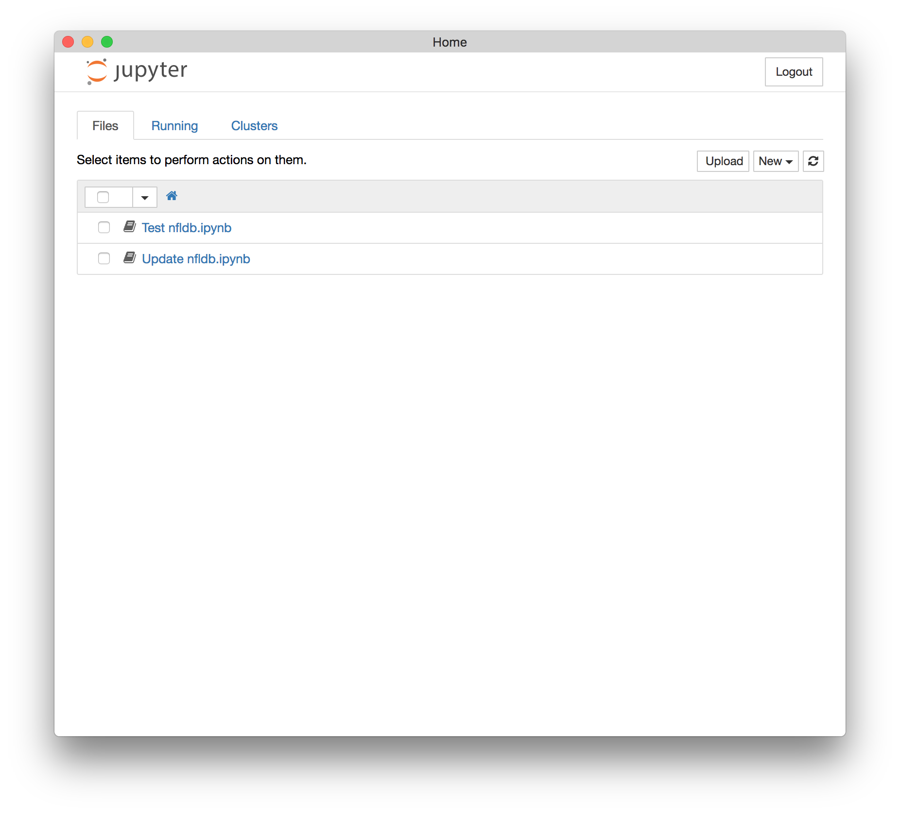
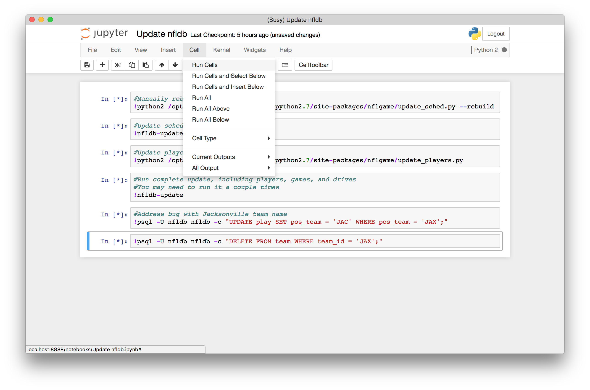
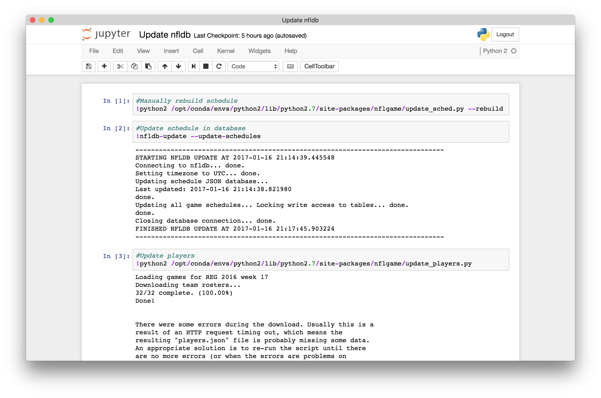
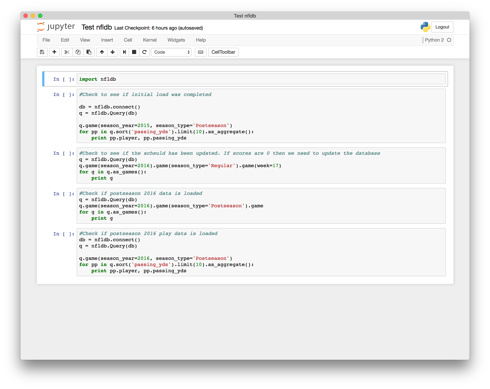

# NFLDB on Docker

I've used [nfldb](https://github.com/BurntSushi/nfldb) for a few fantasy seasons and it's been a great help. I setup a docker install this year and it worked really well. I've bundled everything to start with [docker-compose](https://docs.docker.com/compose/) to make things easier to manage. It includes [Jupyter](http://jupyter.org/) as the python environment, [phppgadmin](https://github.com/einfallstoll/docker-phppgadmin) for backend maintenance, and the official [postgres](https://hub.docker.com/_/postgres/) docker container.

## Getting Started

These instructions will get you a copy of the project up and running on your machine. I've also included a couple of notebooks to update and test nfldb. If you want to automate the updates, you can run nfldb-update from the shell of the jupyter container. Otherwise you can update it manually from the "Update nfldb" notebook.

### Prerequisites

You will need to have docker installed onto your local computer or running on a server. The Docker containers should handle the rest of the requirements for nfldb.


* [Docker for Mac](https://docs.docker.com/docker-for-mac/)
* [Docker for Windows](https://docs.docker.com/docker-for-windows/)
* [Docker for Linux](https://docs.docker.com/engine/installation/linux/)


### Installing

Download the repository from GitHub


```
$ git clone https://github.com/alicona1/nfldb-docker.git
```

Go into the new nfldb-docker directory and start docker-compose. This will start all the containers in daemon mode and immediately output the logs to the terminal. We need to do this because we're waiting for some of the initialization scripts to complete(nfldb.sql takes a while to complete).

```
$ cd nfldb-docker
$ docker-compose up -d  && docker-compose logs -f
```

When the scripts finish you should see somthing like this

```
nfldb-pgsql_1       | PostgreSQL init process complete; ready for start up.
nfldb-pgsql_1       | 
nfldb-pgsql_1       | LOG:  database system was shut down at 2017-01-13 03:53:44 UTC
nfldb-pgsql_1       | LOG:  MultiXact member wraparound protections are now enabled
nfldb-pgsql_1       | LOG:  database system is ready to accept connections
nfldb-pgsql_1       | LOG:  autovacuum launcher started
```

It's ok to press Ctrl + C now and get back to the shell Next we need to log into our jupyter environment.
Get a list of running containers

```
$ docker ps
```

You should see something like this:

```
$ docker ps
CONTAINER ID        IMAGE                     COMMAND                  CREATED             STATUS              PORTS                                         NAMES
034cb4957fa3        kakashi20/nfldb-jpy       "tini -- start-notebo"   3 days ago          Up 14 minutes       0.0.0.0:8888->8888/tcp                        nfldbdocker_nfldb-jpy_1
c3c6bff0c4b5        einfallstoll/phppgadmin   "bash start.sh"          3 days ago          Up 14 minutes       0.0.0.0:8080->80/tcp, 0.0.0.0:8443->443/tcp   nfldbdocker_nfldb-phppgadmin_1
20c1c8c66794        kakashi20/nfldb-pgsql     "/docker-entrypoint.s"   3 days ago          Up 14 minutes       0.0.0.0:5432->5432/tcp                        nfldbdocker_nfldb-pgsql_1
```

We want to copy the name of the jupyter container (ex. nfldbdocker_nfldb-jpy_1) from the list and get the login URL

```
$ docker logs nfldbdocker_nfldb-jpy_1
```

```
[I 15:31:42.772 NotebookApp] The Jupyter Notebook is running at: http://[all ip addresses on your system]:8888/?token=3754af3eab85b7ee00161b97267a18992898a8930dfadc30
[I 15:31:42.772 NotebookApp] Use Control-C to stop this server and shut down all kernels (twice to skip confirmation).
[C 15:31:42.773 NotebookApp] 
    
    Copy/paste this URL into your browser when you connect for the first time,
    to login with a token:
        http://localhost:8888/?token=3754af3eab85b7ee00161b97267a18992898a8930dfadc30
```

Go to the URL and you should get this page.


Click on Update nfldb.ipynb then click the Cell menu and select Run All


These cells will start running and you will see the * next to the cells turn into numbers when they finish running. (Note: The ! in front of the commands are shell commands, so this notebook is just running the existing python scripts in a jupyter notebook. The other notebook really shows you the power of jupyter notebooks.)


After finishing these scripts go back to the home screen and click Test nfldb.ipynb. This is a notebook with actual python in it. You can execute each cell individually to help with trouble shooting. The keyboard shortcut to execute a cell is Ctrl + Enter


Notes
* This docker-compose puts the postgres database into a docker volume that gets delete if you run the command: `$ docker-compose down` If you want to save it to a directory you have to map a directory to the volume in docker-compose.yml. See the jupyter notebook volumes in docker-compose.yml for an example.

## Acknowledgments

* Thanks to BurntSushi for nfldb. I've made it to fantasy playoffs every year since using nfldb (but only won 1 championship :disappointed:).
